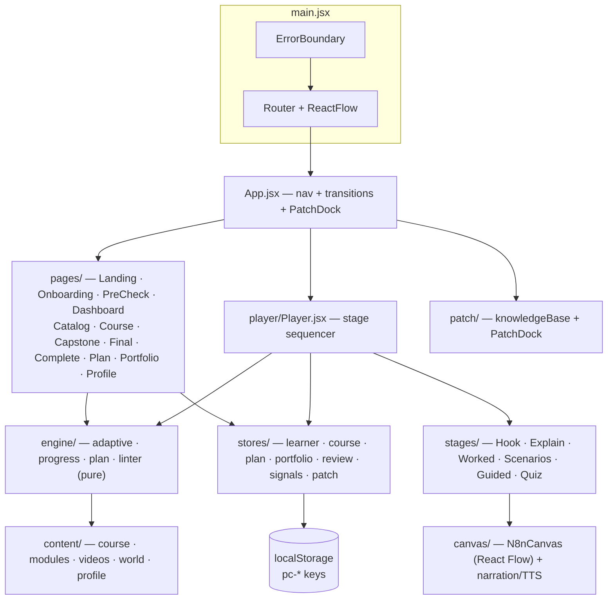

# architecture.md — Frontend architecture

How the Nebula KnowLab SPA is put together today: single-page React 19 + Vite 6 app, no backend, all state in the browser.

> System-level design (including the planned backend/cloud evolution) lives in [`Systemdesign.md`](./Systemdesign.md). Coding conventions for agents: [`agents.md`](./agents.md).

---

## 1. Stack

| Layer | Choice | Notes |
|---|---|---|
| UI | React 19 | function components only |
| Routing | react-router-dom v7 | route table in `App.jsx` |
| State | Zustand 5 (+ `persist` middleware) | 7 stores, see §4 |
| Animation | `motion` (Framer Motion) | `AnimatePresence` page transitions, `MotionConfig` for reduced motion |
| Node canvas | @xyflow/react 12 | the n8n workflow simulation |
| Icons | lucide-react | |
| Styling | hand-written CSS + design tokens (`src/index.css`) | no framework |
| Fonts | DM Sans (UI), JetBrains Mono (code/nodes) | Google Fonts, preconnected |
| Build | Vite 6 | `@vitejs/plugin-react`, dev server on :5173, `host: true` |

## 2. Bootstrap flow

```
main.jsx
  primeVoices()                  pre-warm browser TTS voices (canvas narration fallback)
  └─ <React.StrictMode>
      └─ <ErrorBoundary>
          └─ <BrowserRouter>
              └─ <ReactFlowProvider>
                  └─ <App/>
```

`App.jsx` renders:

1. **Top nav** — minimal header on entry routes (`/`, `/onboarding`, `/precheck`) so setup can't be abandoned mid-flow; full `TopNav` elsewhere.
2. **`<AnimatePresence>` page transitions** — keyed by pathname, variants from `motion.js`; `MotionConfig reducedMotion` honors the learner's accessibility setting.
3. **`PatchDock`** — the assistant's chat dock, on every non-entry route.

## 3. Routes

Declared in one array in `App.jsx`:

| Path | Screen | Purpose |
|---|---|---|
| `/` | Landing | course pitch, start |
| `/onboarding` | Onboarding | profile questionnaire (domain, role, experience) |
| `/precheck` | PreCheck | the one pre-assessment (skippable, "I'm new" path) |
| `/dashboard` | Dashboard | resume point, plan, reviews, progress rings |
| `/catalog` | Catalog | course card + skills |
| `/course/:courseId/:tab?` | Course | course home: overview / stack / field notes tabs |
| `/player/:moduleId` | Player | the lesson player (stages, see §5) |
| `/capstone` | Capstone | course capstone build |
| `/final` | FinalAssessment | 12 questions, pass 80%, never adapts |
| `/complete` | Complete | wrap-up |
| `/plan` | LearningPlan | day-by-day schedule builder |
| `/portfolio` | Portfolio | artifacts: workflows + linter reports + reviews |
| `/profile` | Profile | settings, demo access toggle, reset |
| `/stack`, `/bingo` | redirects | tabs of the course page |
| `*` | NotFound | |

## 4. State — the seven stores

All persisted state uses Zustand `persist` into localStorage (keys prefixed `pc-`), each with `version` + `migrate()`:

| Store (file) | Persist key | Holds |
|---|---|---|
| `useLearner` (`stores/learner.js`) | `pc-learner` | profile answers, pre-assessment result, calibration, reference book (teach-backs), drills, demo mode flag |
| `useCourse` (`stores/course.js`) | `pc-course` | per-module progress: `stages{}`, quiz results, `last` resume pointer, capstone, final result |
| plan (`stores/plan.js`) | — | learning-plan sessions on days + "plan it for me" preferences (derives from course/review/learner) |
| `usePortfolio` (`stores/portfolio.js`) | — | real artifacts: exported workflows, linter reports, reviews ("proof, not badges") |
| `useReview` (`stores/review.js`) | — | spaced "workflow health checks" scheduled on module completion (3/10/30-day ladder) |
| `useSignals` (`stores/signals.js`) | — | interaction telemetry feeding adaptivity: replays, hint depth, check fails, wrong drops… (never shown to learners) |
| `usePatch` (`stores/patch.js`) | *(not persisted)* | assistant message queue, chat open state, per-step help |

Derived state is computed, not stored: `useAdaptation()` memoizes `adaptation(profile, precheck)` from the pure engine.

**Progress shape (per module):**

```js
progress[moduleN] = {
  stages: { 'hook': ts, '1.1-explain': ts, '1.1-worked': ts, '1.1-scenarios': ts,
            … 'guided': ts, 'quiz': ts },   // first-completion timestamps
  quiz: { best, passed, attempts, last },
  completed, completedAt,
}
```

Stage keys are stable identifiers: reordering the *delivery order* never rewrites keys, so saved progress survives adaptive re-ordering.

## 5. The Player (learning flow)

`player/Player.jsx` is the sequencer:

1. Resolves module content from `content/modules/index.js` (`CONTENT[moduleN]`).
2. Builds the stage list via **`engine/progress.js#stageList`** — the same function the Learning Plan schedules from, so player and plan can never drift:
   `hook → (per sub-module: explain → worked → scenarios, in the learner's adapted order) → guided → quiz` (lite/video modules: one explain per lesson → quiz).
3. Maps stage kinds to components via `KIND` (`stages/HookStage`, `ExplainerStage`, `WorkedExampleStage`, `ScenarioQsStage`, `GuidedPracticeStage`, `QuizStage`; shared shell `StageShell`, `PredictReveal` for predict-then-reveal moments).
4. Honors `?state.step` / location state from the dashboard's **Resume** button.
5. Locks/unlocks via `engine/progress.js#isUnlocked` (demo mode unlocks all; otherwise sequential + calibration start point).

Each stage completion is recorded through `useCourse.markStage` (first-completion timestamp kept).

## 6. The engine layer (pure functions)

`src/engine/` contains the product's brain, deliberately free of React/stores so it is portable and auditable (the backend plan ports these 1:1 to Python):

- **`adaptive.js`** — three-layer adaptivity, strongest last:
  1. *stated* — profile questionnaire (experience level, preferred learning style)
  2. *measured* — pre-assessment items per lesson → support level (`extra | standard | light`)
  3. *behavioral* — `signals` (two failed checks / replays → surface the analogy layer)
  Output: lesson ordering (`example | idea | try`), per-lesson support, analogy triggers — each with a *source* label so the UI can explain every adaptation. Quiz questions and pass marks never adapt (product rule).
- **`progress.js`** — stage lists, unlocking, `resumePoint`, `courseNext` (module → capstone → final → done), time estimates.
- **`plan.js`** — splits units into daily sessions using pace factors and review cadence.
- **`linter.js`** — scores exported workflows for portfolio artifacts.

## 7. Content layer

`src/content/` is data, not logic:

- `course.js` — the spine: `COURSE` (skills, problem statement, final assessment with answer keys), `MODULES` (titles, pains, hours saved, sub-module notes).
- `modules/m1–m4.js` — lesson beats, worked examples, scenario questions, quizzes (registered via `modules/index.js` as `CONTENT`).
- `videos/*.js` — video-lesson scripts (`VideoLesson` renders them as animated slides with narration).
- `world.js` — domain packs (manufacturing / IT / retail / finance / custom) that rephrase every sub-module "in your world", plus role-specific hooks/briefs.
- `profile.js` — questionnaire definition (single source for onboarding + settings).

## 8. Canvas, narration, Patch

- **`canvas/`** — the n8n simulation on React Flow: `N8nCanvas` + `CanvasNode`/`NodeIcon`, auto-layout (`layout.js`), a timeline hook (`useTimeline`) and audio-beat sync (`useAudioBeat`). Narration plays per beat: committed MP3s from `public/audio/` (`content/audio.js` maps beats → files), with a browser-TTS fallback (`tts.js`).
- **`patch/`** — the assistant: `knowledgeBase.js` is a deterministic keyword-matched KB built from course concepts, with a hard scope guard (answers only about Nebula/n8n/current module); `PatchDock` renders the queue/chat and stages can push contextual help.

## 9. Cross-cutting concerns

- **Demo mode** — `useLearner.demoMode` (default on): every built module unlocked, anything clickable, reset button in Profile. The demo must always work offline and without setup.
- **Accessibility** — reduced-motion honored globally (`MotionConfig`), text-scale class on the app root, `:focus-visible` outlines, contrast-checked muted inks.
- **Error handling** — top-level `ErrorBoundary` in `main.jsx`.
- **Persistence safety** — store migrations (see `agents.md` hard rule 2); `resetAll` actions back the Profile's "Reset ALL prototype data".

## 10. Component diagram



## 11. Build & deploy (current)

- `npm run dev` — Vite dev server (LAN-exposed, port 5173).
- `npm run build` → static `dist/` (already present in the repo) — deployable to any static host/CDN. No server-side rendering, no API calls at runtime.
